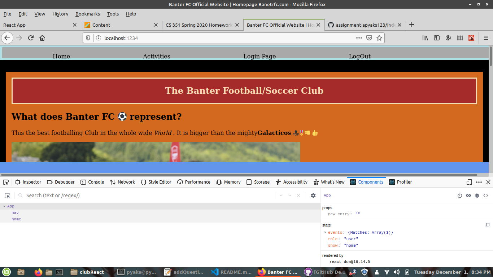
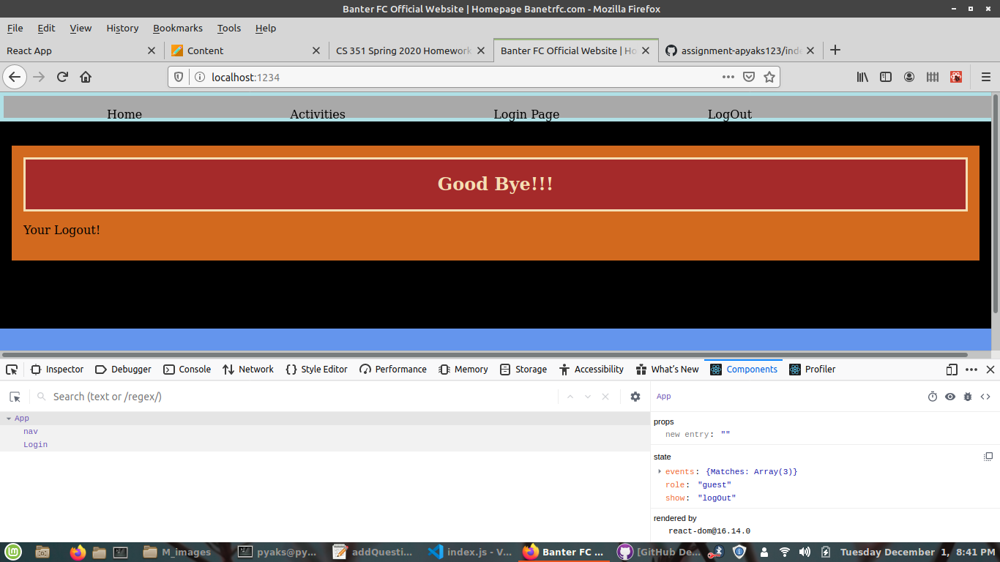
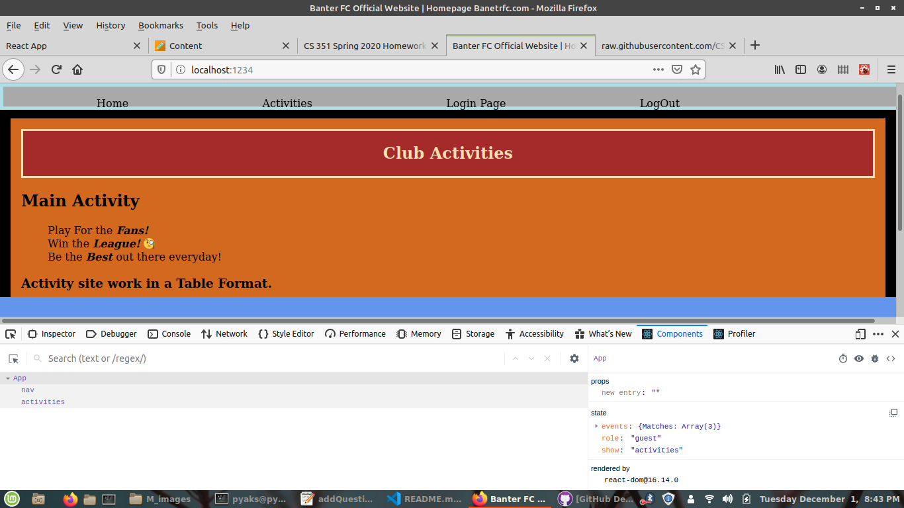
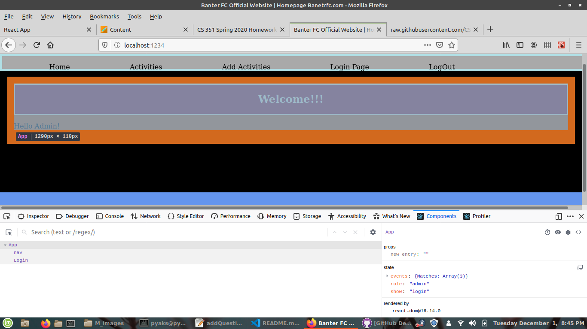
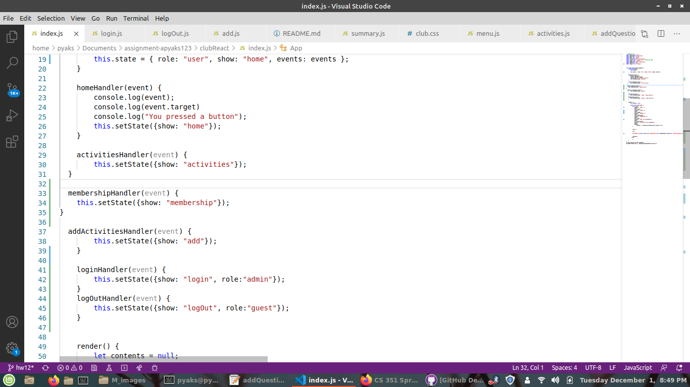
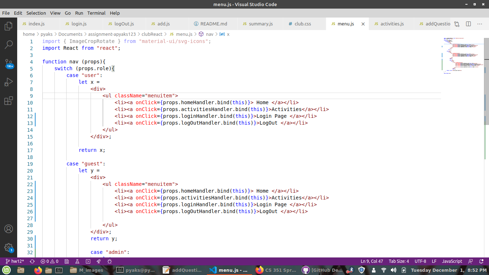
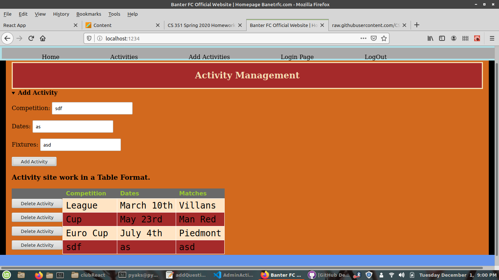
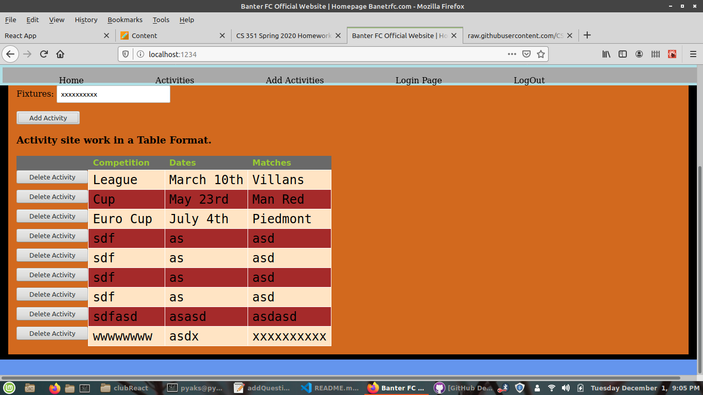
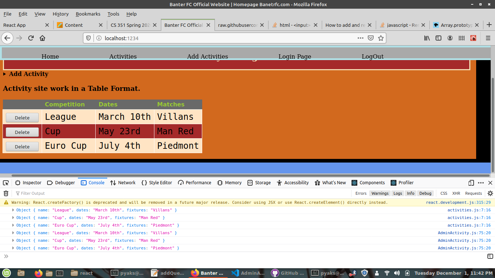
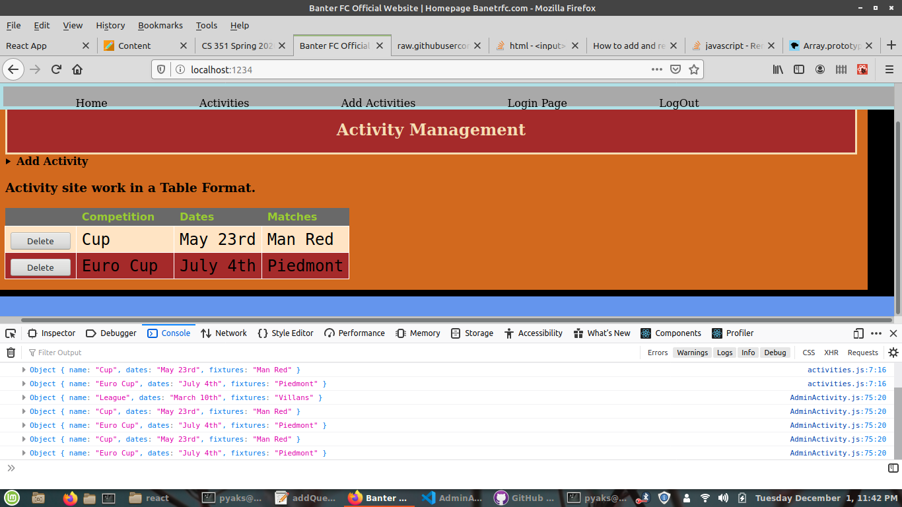

**Student Name**:  ABHISHEK PYAKUREL

**NetID**: tk3223

#Homework 12 Solutions

## Question 1. Dynamic Menu based on State

### 1(a).Menu and States

```javascript
function nav (props){
    switch (props.role){
        case "user":
            let x =
                <div>
                    <ul className="menuitem"> 
                        <li><a onClick={props.homeHandler.bind(this)}> Home </a></li>
                        <li><a onClick={props.activitiesHandler.bind(this)}>Activities</a></li>
                        <li><a onClick={props.loginHandler.bind(this)}>Login Page </a></li>
						<li><a onClick={props.logOutHandler.bind(this)}>LogOut </a></li>
                    </ul>
                </div>;

            return x;

        case "guest":
            let y = 
                <div>
                    <ul className="menuitem">
						<li><a onClick={props.homeHandler.bind(this)}> Home </a></li> 
						<li><a onClick={props.activitiesHandler.bind(this)}>Activities</a></li>
                        <li><a onClick={props.loginHandler.bind(this)}>Login Page </a></li>
						<li><a onClick={props.logOutHandler.bind(this)}>LogOut </a></li>
                        
                    </ul>
                </div>;
				return y;
				
				case "admin":
					let z = 
						<div>
							<ul className="menuitem">
								<li><a onClick={props.homeHandler.bind(this)}> Home </a></li> 
								<li><a onClick={props.activitiesHandler.bind(this)}>Activities</a></li>
                        		<li><a onClick={props.addActivitiesHandler.bind(this)}>Add Activities</a></li>
								<li><a onClick={props.loginHandler.bind(this)}>Login Page </a></li>
                        		
								<li><a onClick={props.logOutHandler.bind(this)}>LogOut </a></li>
							</ul>
						</div>;
						return z;

        default: return <h1>No project match</h1>;
    }
}


homeHandler(event) {
        console.log(event);
        console.log(event.target)
        console.log("You pressed a button");
        this.setState({show: "home"});
    }
    
	activitiesHandler(event) {
		this.setState({show: "activities"});
  }

  membershipHandler(event) {
    this.setState({show: "membership"});
}

  addActivitiesHandler(event) {
		this.setState({show: "add"});
    }
    
    loginHandler(event) {
		this.setState({show: "login", role:"admin"});
    }
    logOutHandler(event) {
		this.setState({show: "logOut", role:"guest"});
    }


```


### 1.(b) Dynamic Menu

#### 1. Show a screenshot with role = “user”.


#### 2. Show a screenshot with role = “guest”.



### 1(c) Optional Active Component

#### 1. Activity Page for guest


#### 2. Guest is Priveldged to Admin through Login Nav




#### 3. Menu component code

```javascript
function nav (props){
    switch (props.role){
        case "user":
            let x =
                <div>
                    <ul className="menuitem"> 
                        <li><a onClick={props.homeHandler.bind(this)}> Home </a></li>
                        <li><a onClick={props.activitiesHandler.bind(this)}>Activities</a></li>
                        <li><a onClick={props.loginHandler.bind(this)}>Login Page </a></li>
						<li><a onClick={props.logOutHandler.bind(this)}>LogOut </a></li>
                    </ul>
                </div>;

            return x;

        case "guest":
            let y = 
                <div>
                    <ul className="menuitem">
						<li><a onClick={props.homeHandler.bind(this)}> Home </a></li> 
						<li><a onClick={props.activitiesHandler.bind(this)}>Activities</a></li>
                        <li><a onClick={props.loginHandler.bind(this)}>Login Page </a></li>
						<li><a onClick={props.logOutHandler.bind(this)}>LogOut </a></li>
                        
                    </ul>
                </div>;
				return y;
				
				case "admin":
					let z = 
						<div>
							<ul className="menuitem">
								<li><a onClick={props.homeHandler.bind(this)}> Home </a></li> 
								<li><a onClick={props.activitiesHandler.bind(this)}>Activities</a></li>
                        		<li><a onClick={props.addActivitiesHandler.bind(this)}>Add Activities</a></li>
								<li><a onClick={props.loginHandler.bind(this)}>Login Page </a></li>
                        		
								<li><a onClick={props.logOutHandler.bind(this)}>LogOut </a></li>
							</ul>
						</div>;
						return z;

        default: return <h1>No project match</h1>;
    }
}

```

## Question 2.   Change App state with Menu

###  2(a) Explain Changes to App Component

Well In App Component I needed to add event handling listeners for all the navigations. Just like the picture below shows. As well as for my program I also needed to update what I return on my nav with all the event binding the listeners.




### 2 (b) Explain Changes to Menu Component

Well first of all i needed to use conditional cases for three based on user roles. For that I chose to use react switch cases as per the state role. From there I also needed to bind those to the event handler function previosly declared in index.js. onClick function is what I use. On onclick function i had to bind the props from the event handler. Apart from that it was still same from previous assignment.


## 3 Activity Management

### 3a. Club Activity Management Mockup



### 3b.Menu Item for “Manage Activities”


#### menu code:
```javascript
<li><a onClick={props.addActivitiesHandler.bind(this)}>Add Activities</a></li>
```


### 3(c) Add Activity Functionality

What kind of component should we use?
It better to use class component as it gets super long as you need alot of event handling functions.

#### Sample Screenshot




#### Show the component view --> only initial is shown because its too long

```javascript
import React from "react";
import events from "./events.json" // Importing JSON!


class MyComponent extends React.Component {
    constructor(props) {
        super(props); // Must call
        this.state = { role: "admin", show: "add", events: events, Competition : null, Dates : null, Fixtures : null
     };
    }

    handleCompetition = (event) => {
        event.preventDefault();
        this.setState({Competition: event.target.value})
        console.log(data);
    }
    

```

### 3(d) AdminActivity Component Constructor.

```javascript
constructor(props) {
        super(props); // Must call
        this.state = { role: "admin", show: "AdminActivity", events: events, Competition : null, Dates : null, Fixtures : null
     };
    }

```


### 3(e) Show JSX code for Inputs and Buttons
```javascript
<details>
            
            <summary><strong>Add Activity </strong></summary>
            <form onSubmit={this.handleSubmit}>
                <p>Competition: <input type='text' name='Competition' onChange={this.handleCompetition.bind(this)}/> </p>
                <p>Dates: <input type='text' name='Dates' onChange={this.handledates.bind(this)}/> </p>
                <p>Fixtures: <input type='text' name='Fixtures' onChange={this.handleFixtures.bind(this)}/> </p>

                <p><button onClick={this.addEvent.bind(this)}>Add Activity</button></p>
                </form>
             
        </details>
```


### 3(f) Show Event handling functions

```javascript
handleCompetition = (event) => {
        event.preventDefault();
        this.setState({Competition: event.target.value})
        console.log(data);
    }
    handledates = (event) => {
        event.preventDefault();
        this.setState({Dates: event.target.value})
        console.log(data);
    }
    handleFixtures = (event) => {
        event.preventDefault();
        this.setState({Fixtures: event.target.value})
        console.log(data);
    }
   

    addEvent = (event) => {
        event.preventDefault();
        let dons = this.props.events.Matches;
        
        let inputThis = {
            name: this.state.Competition, 
            dates: this.state.Dates, 
            fixtures: this.state.Fixtures
        }
        
        
        

        dons.push(inputThis);

        let rows = dons.map(function(u, i){
            <tr key={u.name}><td>{u.name} </td><td>{u.dates}</td><td>{u.fixtures}</td></tr>;
        });

        this.setState({
            events: rows
        });

    }
```


## 4.  Deleting Activities 

### 4(a). Functionality to Delete Activities

#### 1. Prior to Deletion


#### 2. After Deletion



### 4.b Show Modification to JSX

```javascript
    
        return <tr  key={u.name}>
            <td> <button onClick={this.handleClick.bind(this, i)}> Delete</button></td>
            <td>{u.name} </td>
            <td>{u.dates}</td>
            <td>{u.fixtures}</td>
            </tr>;
        });


```


### 4.c Show Event Handler

```
handleClick = ( i) => {
        // console.log("Here i am");
        // console.log(i);
        // console.log(this.props.events.Matches);
        var contacts = this.props.events.Matches;
    contacts.splice(i, 1);
    this.setState({events: contacts});
  


    }
   
```


### 4.d Deploy to Server
[Link to Home Page](http://csweb01.csueastbay.edu/~tk3223/clubReactHW12/)
